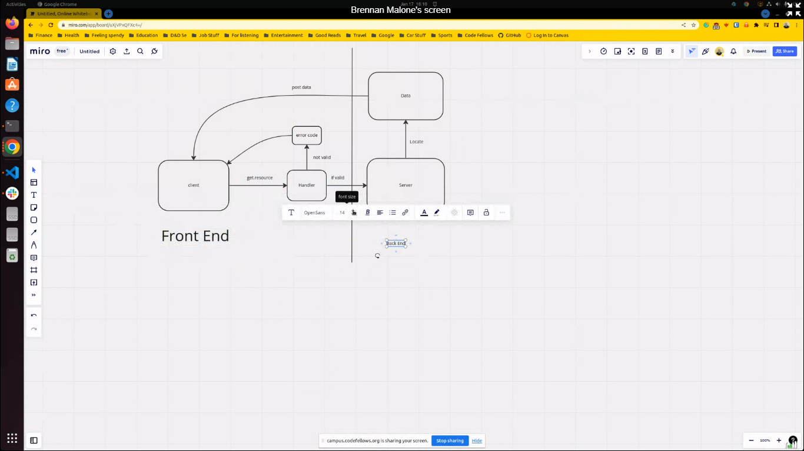
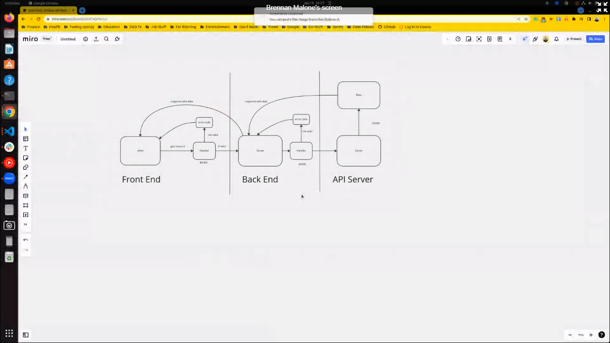

# city-explorer-api

;

# Project Name

**Author**: Your Name Goes Here
**Version**: 1.0.0 (increment the patch/fix version number if you make more commits past your first submission)

## Overview
<!-- Provide a high level overview of what this application is and why you are building it, beyond the fact that it's an assignment for this class. (i.e. What's your problem domain?) -->

## Getting Started
<!-- What are the steps that a user must take in order to build this app on their own machine and get it running? -->

## Architecture
<!-- Provide a detailed description of the application design. What technologies (languages, libraries, etc) you're using, and any other relevant design information. -->

## Change Log
1/18 7:00 hopefully functional call to backend server. build out movie and weather objects and constructors. imported keys.

## Credit and Collaborations

[https://github.com/brennan-malone](help from Brennan Malone)

Name of feature: set up server

Estimate of time needed to complete: 1hr

Start time: 8

Finish time: 915

Actual time needed to complete: 1hr and 15 min. wanted to rewatch class zoom and make sure i understand conceptually.

Name of feature: request and response weather

Estimate of time needed to complete: 2hrs

Start time: 4pm

Finish time: 7pm

Actual time needed to complete: 3hrs

Name of feature: render weather with Weather.js

Estimate of time needed to complete: 1hrs

Start time: 4pm

Finish time: 7pm

Actual time needed to complete: done concurrently with other updates

Name of feature: create API callout to movie API

Estimate of time needed to complete: 1hrs

Start time: 4pm

Finish time: 7:30

Actual time needed to complete: done concurrently with other updates

